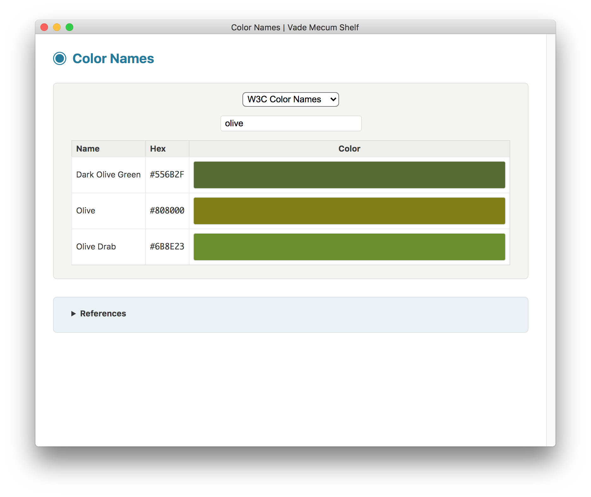
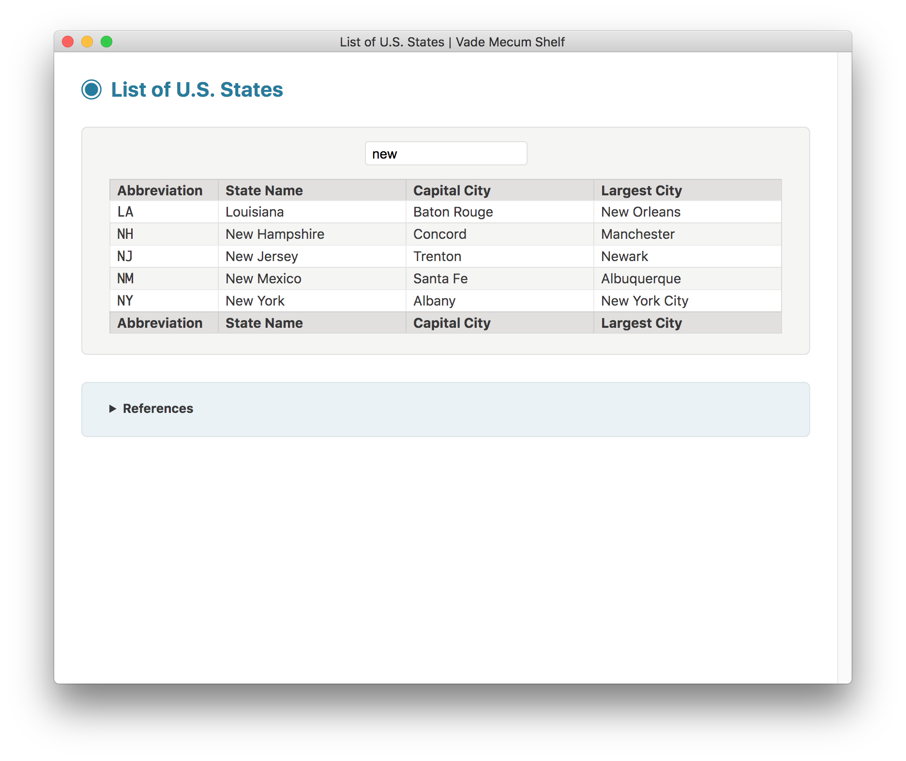

#  VADE MECUM SHELF

**Vade Mecum Shelf** is a collection of utilities wrapped into one single app, built with [Electron](https://electron.atom.io).

This app works on Mac OS X, Linux and Windows operating systems.

Its *look and feel* is partly inspired by the brilliant [Electron API Demos](https://github.com/electron/electron-api-demos) app, but it makes use of a more dynamic modular approach: each utility is made of an independent, self-contained folder including all necessary files.

## Features

- The app window is resizable; its title displays the currently selected utility name next to the app name.

- The visibility of the navigation sidebar, as well as the use of categories, can be toggled on and off from the `View` menu.

- It is possible to quickly scroll to the top or to the bottom of the utility from the `View` menu.

- A utility can be displayed either by clicking its name in the navigation sidebar, or by selecting its name from the `Utilities` menu.

- From the `Developer` menu, it is possible to reveal the app's executable file, and also to open the user data directory (where the persistent settings get stored), as well as the temporary items directory.

## Utilities

The following utilities are currently available:

* [CIDR Calculator](#cidr-calculator)
* [Color Names](#color-names)
* [Departments of France](#departments-of-france)
* [Digital Clock](#digital-clock)
* [Emoji Data Finder](#emoji-data-finder)
* [Emoji Picture Book](#emoji-picture-book)
* [HTTP Status Codes](#http-status-codes)
* [IETF Language Tags](#ietf-language-tags)
* [ISO Country Codes](#iso-country-codes)
* [ISO Language Codes](#iso-language-codes)
* [ISO Script Codes](#iso-script-codes)
* [Jabberwocky](#jabberwocky)
* [JavaScript Runner](#javascript-runner)
* [JSON Formatter](#json-formatter)
* [LaTeX Math Renderer](#latex-math-renderer)
* [List of U.S. States](#list-of-us-states)
* [Prefectures of Japan](#prefectures-of-japan)
* [Roman Numerals](#roman-numerals)
* [System Information](#system-information)
* [Technical Definitions](#technical-definitions)
* [Text Scratchpad](#text-scratchpad)
* [Trigonometric Formulas](#trigonometric-formulas)
* [Unicode Data Finder](#unicode-data-finder)
* [Unicode Inspector](#unicode-inspector)

## CIDR Calculator

Simple CIDR calculators:

* CIDR to IP Range
* IP Range to CIDR List


## Color Names

Lists of color names, with live search:

* W3C Color Names
* X11 Color Names
* Mac OS X Crayons



## Departments of France

Full list of French departments, with live search:


## Digital Clock

Customizable clock, using language-sensitive text formatting for date and time:


## Emoji Data Finder

Data (short name, keywords, code) of Unicode emoji characters extracted from a string:


## Emoji Picture Book

Lists of Unicode emoji characters, by group:

* Smileys & People
* Animals & Nature
* Food & Drink
* Travel & Places
* Activities
* Objects
* Symbols
* Flags


## HTTP Status Codes

Full list of HTTP status codes, with definitions in several languages:

* English
* French
* Japanese


## IETF Language Tags

References for IETF BCP 47 language tags and subtags:


## ISO Country Codes

Full list of ISO 3166-1 country codes, with live search:


## ISO Language Codes

Full list of ISO 639-1 language codes, with live search:


## ISO Script Codes

Full list of ISO 15924 script codes, with live search:


## Jabberwocky

Typographic rendition of Lewis Carroll's nonsense poem "Jabberwocky":


## JavaScript Runner

JavaScript code runner, useful for quick testing/prototyping or data processing:


## JSON Formatter

JSON data formatter and validator:


## LaTeX Math Renderer

LaTeX math expression renderer, using the KaTeX JavaScript library:


## List of U.S. States

Full list of states and territories of the United States, with live search:



## Prefectures of Japan

Full list of prefectures of Japan, with live search:


## Roman Numerals

Converters between roman and arabic numerals:

* Roman to Arabic Numeral
* Arabic to Roman Numeral


## System Information

Detailed list of system information, by category:

* Framework
* Main Process
* Renderer Process
* Application
* Navigator
* Operating System
* OS User Info
* Screen
* Window
* Environment


## Technical Definitions

Lists of technical definitions:

* Computing Abbreviations
* Mac OS Release Names
* Metric Prefixes | Fractions
* Metric Prefixes | Multiples
* Binary Prefixes
* Name of a Polynomial by Degree


## Text Scratchpad

Scratchpad to store persistent text data:


## Trigonometric Formulas

Sets of trigonometric formulas, by category:

* Basic Definitions
* Symmetry Identities
* Cofunction Identities
* Pythagorean Identities
* Sum to Product
* Product to Sum
* Squares
* Half Angle
* Sum of Angles
* Double Angle


## Unicode Data Finder

Basic data of Unicode characters found by name:


## Unicode Inspector

Code point information of Unicode characters:


## Building

You'll need [Node.js](https://nodejs.org) installed on your computer in order to build this app.

```bash
git clone https://github.com/tonton-pixel/vade-mecum-shelf
cd vade-mecum-shelf
npm install
npm start
```

If you don't wish to clone, you can [download the source code](https://github.com/tonton-pixel/vade-mecum-shelf/archive/master.zip).

Several scripts are also defined in the `package.json` file to build OS-specific bundles of the app, using the simple yet powerful [Electron Packager](https://github.com/electron-userland/electron-packager) Node module.\
For instance, running the following command will create a `Vade Mecum Shelf.app` version for Mac OS X:

```bash
npm run build-darwin
```

## Using

You can [download the latest release](https://github.com/tonton-pixel/vade-mecum-shelf/releases) for Mac OS X.

## Known Issues

- In Linux (at least on **Linux Mint 18.2 Sonya** and **Ubuntu 16.04.3 LTS**), there is a [bug](https://github.com/electron/electron/issues/10388) which prevents the window position to be correctly recorded between consecutive runs, a slight shift to the bottom right occurs systematically.

- In **Ubuntu 16.04.3 LTS**, the `Utilities` menu is never updated whenever one of its items is selected, or when the selection is triggered programmatically. This [bug](https://github.com/electron/electron/issues/11386) affects all menus made of radio-buttons items.

## Limitations

- The Undo/Redo stack is common to all text editing elements of the app, including those which are hidden. This behavior is a known shortcoming and cannot be changed or improved for the time being.

- Although this app has been developed from the start with multiple platforms in mind, it has only been successfully tested on Mac OS X (Yosemite 10.10.5 and El Capitan 10.11.6), and on two Linux *flavors*, [Linux Mint 18.2 Sonya](https://linuxmint.com/edition.php?id=237) and [Ubuntu 16.04.3 LTS](http://releases.ubuntu.com/16.04/), installed into [VirtualBox](https://www.virtualbox.org/).

## License

The MIT License (MIT).

Copyright © 2017-2018 Michel MARIANI.
