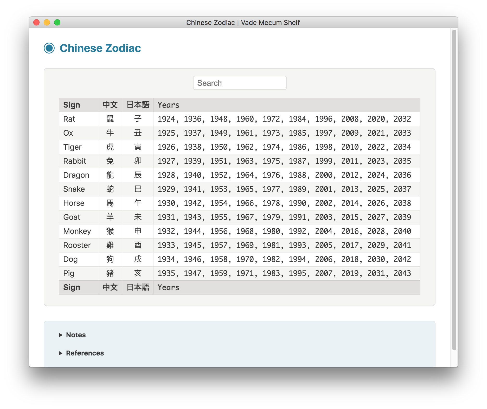
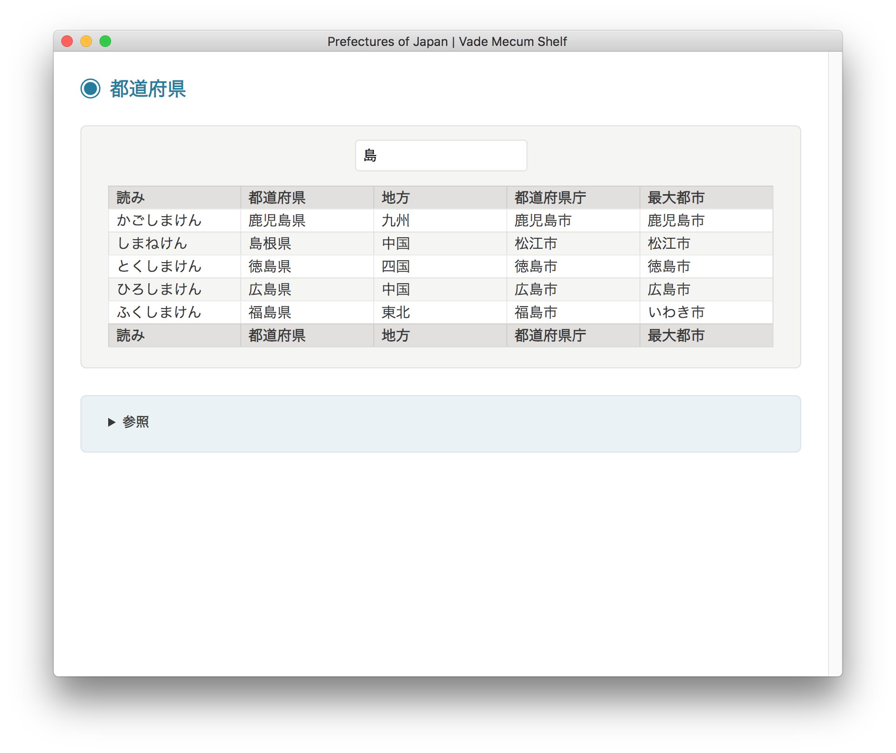

#  VADE MECUM SHELF

**Vade Mecum Shelf** is a collection of utilities wrapped into one single app, built with [Electron](https://electronjs.org).

This app works on Mac OS X, Linux and Windows operating systems.

Its *look and feel* is partly inspired by the brilliant [Electron API Demos](https://github.com/electron/electron-api-demos) app, but it makes use of a more dynamic modular approach: each utility is made of an independent, self-contained folder including all necessary files.

## Utilities

The following utilities are currently available:

- **Chemical Elements**
- **Chinese Zodiac**
- **CIDR Calculator**
- **Color Names**
- **CSS Cursors Demo**
- **Departments of France**
- **Digital Clock**
- **HTTP Status Codes**
- **IETF Language Tags**
- **ISO Country Codes**
- **ISO Language Codes**
- **ISO Script Codes**
- **Jabberwocky**
- **JavaScript Parser**
- **JavaScript Runner**
- **JSON Formatter**
- **LaTeX Math Renderer**
- **List of U.S. States**
- **Prefectures of Japan**
- **Roman Numerals**
- **System Information**
- **Technical Definitions**
- **Text Converter**
- **Trigonometric Formulas**

## Chemical Elements

Full list of chemical elements, with live search:


## Chinese Zodiac

Full list of the twelve Chinese zodiac signs, with live search:



## CIDR Calculator

Simple CIDR calculators:

* CIDR to IP Range
* IP Range to CIDR List


## Color Names

Lists of color names, with live search:

* W3C Color Names
* X11 Color Names
* Mac OS X Crayons


## CSS Cursors Demo

Display CSS cursors by category:


## Departments of France

Full list of French departments, with live search:


## Digital Clock

Customizable clock, using language-sensitive text formatting for date and time:


## HTTP Status Codes

Full list of HTTP status codes, with definitions in several languages:

* English
* French
* Japanese


## IETF Language Tags

References for IETF BCP 47 language tags and subtags:


## ISO Country Codes

Full list of ISO 3166-1 country codes, with live search:


## ISO Language Codes

Full list of ISO 639-1 language codes, with live search:


## ISO Script Codes

Full list of ISO 15924 script codes, with live search:


## Jabberwocky

Typographic rendition of Lewis Carroll's nonsense poem "Jabberwocky":


## JavaScript Parser

JavaScript code parser and tokenizer, based on Esprima:


## JavaScript Runner

JavaScript code runner, useful for quick testing/prototyping or data processing:


## JSON Formatter

JSON data formatter and validator:


## LaTeX Math Renderer

LaTeX math expression renderer, using the KaTeX JavaScript library:


## List of U.S. States

Full list of states and territories of the United States, with live search:


## Prefectures of Japan

Full list of prefectures of Japan, with live search:



## Roman Numerals

Converters between roman and arabic numerals:

* Roman to Arabic Numeral
* Arabic to Roman Numeral


## System Information

Detailed list of system information, by category:

* Framework
* Main Process
* Renderer Process
* Application
* Navigator
* Operating System
* OS User Info
* Screen
* Window
* Environment


## Technical Definitions

Lists of technical definitions:

* Computing Abbreviations
* Mac OS Release Names
* Metric Prefixes | Fractions
* Metric Prefixes | Multiples
* IEC Binary Prefixes | Multiples
* Name of a Polynomial by Degree


## Text Converter

Encode and decode text according to several string formats:

* JSON String
* Hex String
* Base64 String


## Trigonometric Formulas

Sets of trigonometric formulas, by category:

* Basic Definitions
* Symmetry Identities
* Cofunction Identities
* Pythagorean Identities
* Sum to Product
* Product to Sum
* Squares
* Half Angle
* Sum of Angles
* Double Angle


## Building

You'll need [Node.js](https://nodejs.org) installed on your computer in order to build this app.

```bash
git clone https://github.com/tonton-pixel/vade-mecum-shelf
cd vade-mecum-shelf
npm install
npm start
```

If you don't wish to clone, you can [download the source code](https://github.com/tonton-pixel/vade-mecum-shelf/archive/master.zip).

Several scripts are also defined in the `package.json` file to build OS-specific bundles of the app, using the simple yet powerful [Electron Packager](https://github.com/electron-userland/electron-packager) Node module.\
For instance, running the following command will create a `Vade Mecum Shelf.app` version for Mac OS X:

```bash
npm run build-darwin
```

## Using

You can [download the latest release](https://github.com/tonton-pixel/vade-mecum-shelf/releases) for Mac OS X.

## License

The MIT License (MIT).

Copyright © 2017-2019 Michel MARIANI.
