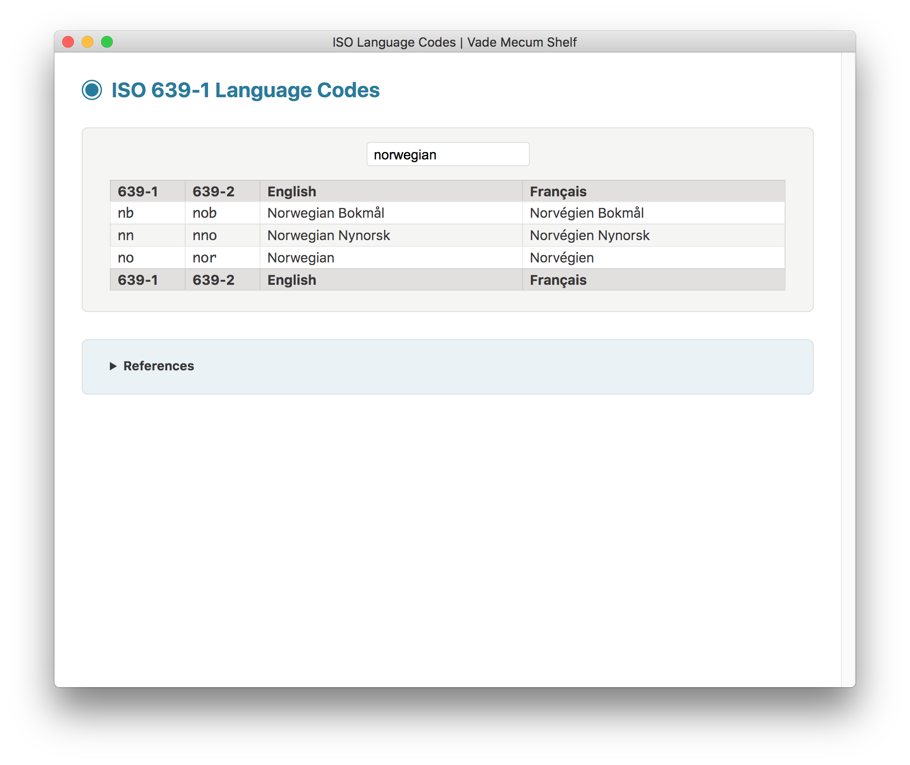
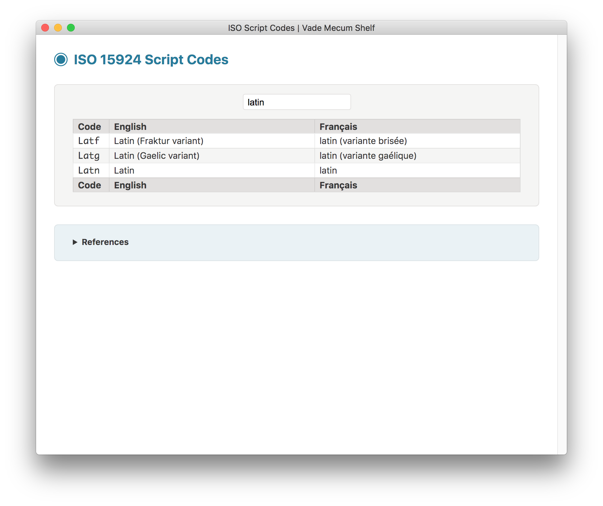
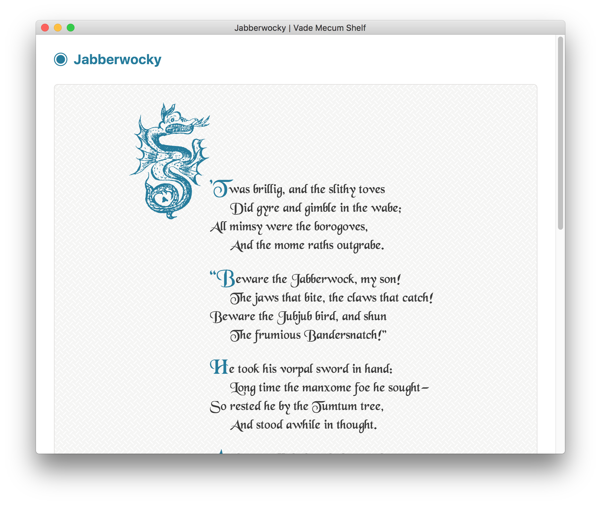
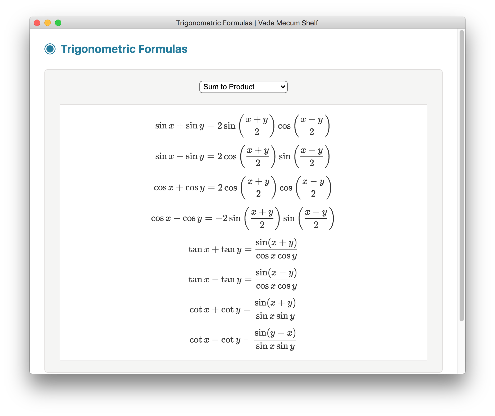

#  VADE MECUM SHELF

**Vade Mecum Shelf** is a collection of vade mecum-like utilities wrapped into one single app, built with [Electron](https://www.electronjs.org/).

This desktop application works on macOS, Linux and Windows operating systems.


## Utilities

The following utilities are currently available:

- **Chemical Elements**
- **Chinese Zodiac**
- **Color Names**
- **Departments of France**
- **Derivative Formulas**
- **HTTP Status Codes**
- **ISO Country Codes**
- **ISO Language Codes**
- **ISO Script Codes**
- **Jabberwocky**
- **List of U.S. States**
- **Prefectures of Japan**
- **Technical Definitions**
- **Trigonometric Formulas**

## Chemical Elements

Full list of chemical elements, with live search:


## Chinese Zodiac

Full list of the twelve Chinese zodiac signs, with live search:


## Color Names

Lists of color names, with live search:

* W3C Color Names
* X11 Color Names
* XKCD Color Names
* Mac OS X Crayons


## Departments of France

Full list of French departments, with live search:


## Derivative Formulas

Sets of derivative formulas, by category:

* Constant Rule
* Sum Rule
* Product Rule
* Quotient Rule
* Chain Rule
* Power Rule
* Exponential
* Logarithmic
* Trigonometric


## HTTP Status Codes

Full list of HTTP status codes, with definitions in several languages:

* English
* French
* Japanese


## ISO Country Codes

Full list of ISO 3166-1 country codes, with live search:


## ISO Language Codes

Full list of ISO 639-1 language codes, with live search:



## ISO Script Codes

Full list of ISO 15924 script codes, with live search:



## Jabberwocky

Typographic rendition of Lewis Carroll's nonsense poem "Jabberwocky":



## List of U.S. States

Full list of states and territories of the United States, with live search:


## Prefectures of Japan

Full list of prefectures of Japan, with live search:


## Technical Definitions

Lists of technical definitions:

* Computing Abbreviations
* Mac OS Release Names
* Unicode Release Dates
* Emoji Release Dates
* Metric Prefixes | Fractions
* Metric Prefixes | Multiples
* IEC Binary Prefixes | Multiples
* Name of a Polynomial by Degree


## Trigonometric Formulas

Sets of trigonometric formulas, by category:

* Basic Definitions
* Symmetry Identities
* Cofunction Identities
* Pythagorean Identities
* Sum to Product
* Product to Sum
* Squares
* Half Angle
* Sum of Angles
* Double Angle



## Using

You can [download the latest release](https://github.com/tonton-pixel/vade-mecum-shelf/releases) for macOS.

## Building

You'll need [Node.js](https://nodejs.org/) (which comes with [npm](https://www.npmjs.com/)) installed on your computer in order to build this application.

### Clone method

```bash
# Clone the repository
git clone https://github.com/tonton-pixel/vade-mecum-shelf
# Go into the repository
cd vade-mecum-shelf
# Install dependencies
npm install
# Run the application
npm start
```

**Note**: to use the clone method, the core tool [git](https://www.git-scm.com/) must also be installed.

### Download method

If you don't wish to clone, you can [download the source code](https://github.com/tonton-pixel/vade-mecum-shelf/archive/master.zip), unZip it, then directly run the following commands from a Terminal opened at the resulting `vade-mecum-shelf-master` folder location:

```bash
# Install dependencies
npm install
# Run the application
npm start
```

### Packaging

Several scripts are also defined in the `package.json` file to build OS-specific bundles of the application, using the simple yet powerful [Electron Packager](https://github.com/electron-userland/electron-packager) Node module.\
For instance, running the following command (once the dependencies are installed) will create a `Vade Mecum Shelf.app` version for macOS:

```bash
# Build macOS (Darwin) application
npm run build-darwin
```

## License

The MIT License (MIT).

Copyright © 2017-2021 Michel Mariani.
